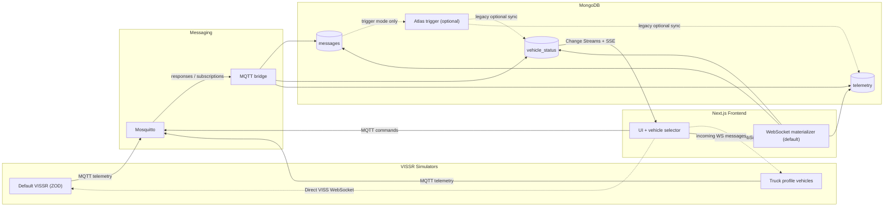

# COVESA VISSR Integration with MongoDB

A proof-of-concept application demonstrating real-time synchronization between the [Vehicle Information Service Specification Reference Implementation (VISSR)](https://github.com/COVESA/vissr) and MongoDB. This interactive web application connects to VISSR servers to stream vehicle telemetry data using the [Vehicle Signal Specification (VSS)](https://covesa.github.io/vehicle_signal_specification/), stores it in MongoDB, and visualizes it in real-time with an intuitive interface.

## About the Project

As vehicles evolve into software-driven machines, the need for standardized vehicle data access grows. The [**Connected Vehicle Systems Alliance (COVESA)**](https://covesa.global/) addresses this with the [**Vehicle Information Service Specification (VISS)**](https://github.com/COVESA/vehicle-information-service-specification) and its reference implementation, VISSR, standardizing how vehicle signals are read and written.

This project explores how VISS-based architectures can extend to scalable cloud environments. By integrating VISSR with MongoDB, we demonstrate how flexible document models and real-time data processing can efficiently manage complex, time-based vehicle data at fleet scale.

## Architecture


This project implements a robust cloud synchronization architecture for vehicle data. The technology stack includes:

- **VISSR Servers**: Simulating vehicles that generate telemetry data.
- **Mosquitto (MQTT Broker)**: Handling scalable, publish-subscribe messaging.
- **Node.js MQTT Bridge**: A dedicated microservice intercepting telemetry and ingesting it into the database.
- **MongoDB**: Providing flexible document storage and real-time Change Streams.
- **Next.js Frontend**: A modern web interface for real-time visualization and command execution.

### Implementation Details

Our reference implementation supports two connectivity modes: a decoupled architecture using MQTT, and direct WebSocket connections for localized simulations.


```mermaid
flowchart LR
  subgraph vehicles [VISSR Simulators]
    zod["Default VISSR (ZOD)"]
    trucks["Truck profile vehicles"]
  end

  subgraph messaging [Messaging]
    mqtt["Mosquitto"]
    bridge["MQTT bridge"]
  end

  subgraph app [Next.js Frontend]
    ui["UI + vehicle selector"]
    wsMat["WebSocket materializer (default)"]
  end

  subgraph mongo [MongoDB]
    messages[("messages")]
    status[("vehicle_status")]
    telemetry[("telemetry")]
    trigger["Atlas trigger (optional)"]
  end

  zod -->|"MQTT telemetry"| mqtt
  trucks -->|"MQTT telemetry"| mqtt
  ui -->|"MQTT commands"| mqtt
  mqtt -->|"responses / subscriptions"| bridge
  bridge --> messages
  bridge --> status
  bridge --> telemetry

  ui -.->|"Direct VISS WebSocket"| zod
  ui -.->|"Direct VISS WebSocket"| trucks
  ui -->|"incoming WS messages"| wsMat
  wsMat --> messages
  wsMat --> status
  wsMat --> telemetry

  status -->|"Change Streams + SSE"| ui
  messages -.->|"trigger mode only"| trigger
  trigger -.->|"legacy optional sync"| status
  trigger -.->|"legacy optional sync"| telemetry
```

## Key Features

- **Dual-Mode Connectivity**:
  - **Cloud-Scale MQTT**: Uses an MQTT broker and an `mqtt-bridge` microservice to ingest telemetry into MongoDB, ensuring a scalable, decoupled architecture.
  - **Direct WebSocket**: Connect directly to a VISSR server via WebSockets. Perfect for using the Zenseact Open Dataset (ZOD) and local simulations.
- **Real-Time Data Sync**: The frontend consumes telemetry via MongoDB Change Streams for instant UI updates.
- **Fleet Ready**: Built to support multiple vehicle containers concurrently (e.g., simulating multiple trucks).
- **Interactive Command Builder**: Send VSS commands and subscribe to signals right from your browser.

## Prerequisites

- **Docker & Docker Compose**
- **Node.js** (v22 or higher) - _If running locally outside of Docker_
- [**MongoDB Atlas**](https://www.mongodb.com/cloud/atlas) (Optional) - You can use the provided local replica set or connect to an Atlas cluster.
- [**Zenseact Open Dataset (ZOD)**](https://zod.zenseact.com/) (Optional) - For realistic vehicle data playback.

## Quick start

1. Create a local environment file:

```bash
cp .env.example .env
```

2. Start the default stack:

```bash
make start
```

3. Open [http://localhost:8080](http://localhost:8080).

4. Pick a vehicle, choose `MQTT` or `WebSocket`, connect, then use the command builder.

## Run modes

The Makefile is the supported entrypoint. Defaults are:

- `PROFILE=zod`
- `DB=local`
- `NUM_VEHICLES=1`

Useful commands:

```bash
make prepare
make build
make start
make restart
make stop
make clean
```

Common combinations:

```bash
# Default ZOD profile with local MongoDB
make start

# Truck profile with one predefined truck
make start PROFILE=truck

# Truck profile with two predefined trucks
make start PROFILE=truck NUM_VEHICLES=2

# Default ZOD profile against Atlas
make start DB=atlas

# Truck profile against Atlas
make start PROFILE=truck DB=atlas NUM_VEHICLES=2
```

## What the flags mean

- `PROFILE=zod` runs the default VISSR simulator backed by the ZOD sample feed.
- `PROFILE=truck` runs the predefined truck vehicle definitions from `infra/vissr/vehicle-definitions/index.json`.
- `NUM_VEHICLES` selects how many predefined truck definitions to start. At the moment the repo defines two truck vehicles.
- `DB=local` starts the bundled MongoDB replica set from `docker-compose.local.yml`.
- `DB=atlas` skips the local MongoDB container and uses `MONGODB_URI` from `.env`.

`make prepare` generates `.generated/runtime.env` and `.generated/docker-compose.trucks.generated.yml`, which are then consumed by the other targets.

## Connection modes

### MQTT

- Commands are published to `/${vin}/Vehicle`.
- The MQTT bridge resolves the VIN from the topic and writes typed data into `messages`, `vehicle_status`, and `telemetry`.
- The UI listens for `vehicle_status` updates through MongoDB Change Streams.

### WebSocket

- The UI connects directly to the selected vehicle's VISS WebSocket endpoint.
- Incoming messages are always stored in `messages`.
- By default, subscription updates are also materialized by the app into `vehicle_status` and `telemetry`.
- If you set `WEBSOCKET_MATERIALIZATION_MODE=trigger`, the legacy Atlas trigger path remains available as an alternative sync option.

## Environment

Only a small `.env` file is needed:

- `MONGODB_URI` is required for `DB=atlas`
- `DATABASE_NAME` is optional and defaults to `vissr-integration`

Runtime values such as `VEHICLE_VINS`, `VSS_JSON_PATH`, `VEHICLE_DEFINITIONS_B64`, and `VSS_JSON_ROOT_DIR` are generated automatically.

## Generating Custom Trip Data (Optional)

If you have the Zenseact Open Dataset (ZOD) and want to generate custom VSS-compliant trip data for the VISSR feeder (especially useful for direct WebSocket mode):

1. Navigate to `utils/notebooks/`
2. Open [`zod-vss-modeling.ipynb`](utils/notebooks/zod-vss-modeling.ipynb) in Jupyter.
3. Follow the notebook to convert ZOD drive data into `tripdata.json`.
4. Use the generated file with your VISSR Feeder.
