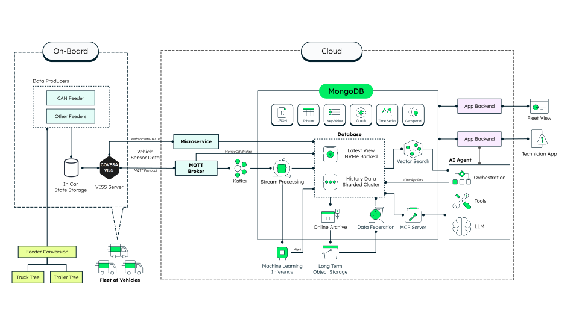
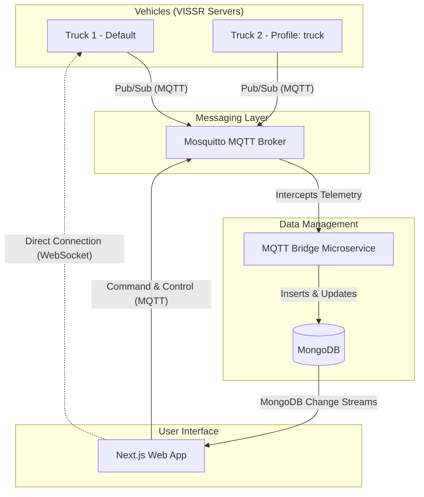

# COVESA VISSR Integration with MongoDB

A proof-of-concept application demonstrating real-time synchronization between the [Vehicle Information Service Specification Reference Implementation (VISSR)](https://github.com/COVESA/vissr) and MongoDB. This interactive web application connects to VISSR servers to stream vehicle telemetry data using the [Vehicle Signal Specification (VSS)](https://covesa.github.io/vehicle_signal_specification/), stores it in MongoDB, and visualizes it in real-time with an intuitive interface.

## About the Project

As vehicles evolve into software-driven machines, the need for standardized vehicle data access grows. The [**Connected Vehicle Systems Alliance (COVESA)**](https://covesa.global/) addresses this with the [**Vehicle Information Service Specification (VISS)**](https://github.com/COVESA/vehicle-information-service-specification) and its reference implementation, VISSR, standardizing how vehicle signals are read and written.

This project explores how VISS-based architectures can extend to scalable cloud environments. By integrating VISSR with MongoDB, we demonstrate how flexible document models and real-time data processing can efficiently manage complex, time-based vehicle data at fleet scale.

## Architecture



This project implements a robust cloud synchronization architecture for vehicle data. The technology stack includes:

- **VISSR Servers**: Simulating vehicles that generate telemetry data.
- **Mosquitto (MQTT Broker)**: Handling scalable, publish-subscribe messaging.
- **Node.js MQTT Bridge**: A dedicated microservice intercepting telemetry and ingesting it into the database.
- **MongoDB**: Providing flexible document storage and real-time Change Streams.
- **Next.js Frontend**: A modern web interface for real-time visualization and command execution.

### Implementation Details

Our reference implementation supports a scalable, decoupled architecture using MQTT, while also supporting direct WebSocket connections for localized simulations.


```mermaid
graph TD
    subgraph Vehicles ["Vehicles (VISSR Servers)"]
        T1[Truck 1 - Default]
        T2[Truck 2 - Profile: truck]
    end

    subgraph Messaging Layer
        MQ[Mosquitto MQTT Broker]
    end

    subgraph Data Management
        MB[MQTT Bridge Microservice]
        DB[(MongoDB)]
    end

    subgraph User Interface
        UI[Next.js Web App]
    end

    T1 -- Pub/Sub (MQTT) --> MQ
    T2 -- Pub/Sub (MQTT) --> MQ

    MQ -- Intercepts Telemetry --> MB
    MB -- Inserts & Updates --> DB

    DB -- MongoDB Change Streams --> UI

    UI -- Command & Control (MQTT) --> MQ
    UI -. Direct Connection (WebSocket) .-> T1
```

## Key Features

- **Dual-Mode Connectivity**:
  - **Cloud-Scale MQTT**: Uses an MQTT broker and an `mqtt-bridge` microservice to ingest telemetry into MongoDB, ensuring a scalable, decoupled architecture.
  - **Direct WebSocket**: Connect directly to a VISSR server via WebSockets. Perfect for using the Zenseact Open Dataset (ZOD) and local simulations.
- **Real-Time Data Sync**: The frontend consumes telemetry via MongoDB Change Streams for instant UI updates.
- **Fleet Ready**: Built to support multiple vehicle containers concurrently (e.g., simulating multiple trucks).
- **Interactive Command Builder**: Send VSS commands and subscribe to signals right from your browser.

## Prerequisites

- **Docker & Docker Compose**
- **Node.js** (v22 or higher) - _If running locally outside of Docker_
- [**MongoDB Atlas**](https://www.mongodb.com/cloud/atlas) (Optional) - You can use the provided local replica set or connect to an Atlas cluster.
- [**Zenseact Open Dataset (ZOD)**](https://zod.zenseact.com/) (Optional) - For realistic vehicle data playback.

## Getting Started

The easiest way to run the entire stack is using Docker Compose.

### 1. Clone the Repository and Configure Environment

```bash
cp .env.example .env.local
# Edit .env.local to add your MONGODB_URI if using Atlas.
# Otherwise, it defaults to the local Docker MongoDB container.
```

### 2. Launch the Application Stack

You can launch the default stack (Frontend, Mosquitto, MQTT Bridge, MongoDB, and 1 Truck) using:

```bash
docker compose --profile local up -d
```

To simulate a fleet with **two trucks**, add the `truck` profile:

```bash
docker compose --profile local --profile truck up -d
```

### 3. Connect and Explore

1. Open [http://localhost:8080](http://localhost:8080) (or your configured frontend port) in your browser.
2. Select your connection protocol:
   - **MQTT**: Connects via Mosquitto. Watch telemetry stream into MongoDB and update the UI in real-time.
   - **WebSocket**: Connect directly to a specific VISSR server IP/port.
3. Click **Connect**.
4. Use the **Command Builder** to subscribe to vehicle signals (e.g., `Vehicle.Speed`).
5. Watch the vehicle data appear in the status panel and on the map!

## Generating Custom Trip Data (Optional)

If you have the Zenseact Open Dataset (ZOD) and want to generate custom VSS-compliant trip data for the VISSR feeder (especially useful for direct WebSocket mode):

1. Navigate to `utils/notebooks/`
2. Open [`zod-vss-modeling.ipynb`](utils/notebooks/zod-vss-modeling.ipynb) in Jupyter.
3. Follow the notebook to convert ZOD drive data into `tripdata.json`.
4. Use the generated file with your VISSR Feeder.
