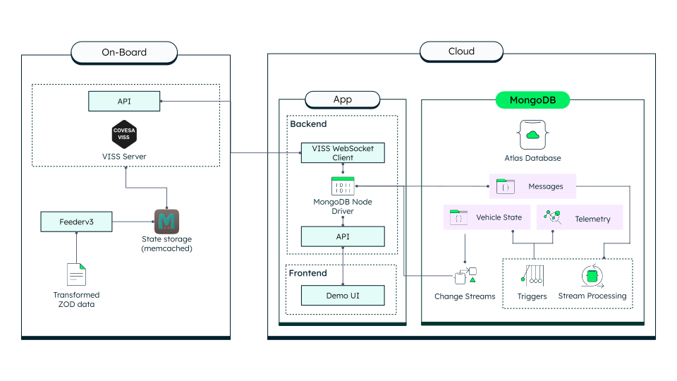

# VISSR <-> MongoDB Integration

A proof-of-concept application demonstrating real-time synchronization between the Vehicle Information Service Specification Reference Implementation (VISSR) and MongoDB. This interactive web application connects to a VISSR server to stream vehicle telemetry data using the Vehicle Signal Specification (VSS), stores it in MongoDB, and visualizes it in real-time with an intuitive interface.

## Architecture



The application uses a modern Next.js frontend that displays synchronized vehicle status and map visualizations. Vehicle telemetry data flows from the VISSR server into MongoDB via an MQTT broker (Mosquitto) and a dedicated Node.js microservice (`mqtt-bridge`). The frontend then consumes this data in real-time using MongoDB change streams, ensuring a decoupled and scalable architecture.

## Prerequisites

Before you begin, ensure you have the following:

- **VISSR Server** - Install and run locally from [COVESA/vissr](https://github.com/COVESA/vissr/tree/master)
- **Zenseact Open Dataset** - Optional, for realistic vehicle data playback ([download options here](https://zod.zenseact.com/download/))
- **MongoDB Atlas** - A cluster (M0 free tier or higher)
- **Node.js** - Version 22 or higher

## Getting Started

### 1. Install Dependencies

```bash
npm install
```

### 2. Configure Environment Variables

Create a `.env.local` file in the root directory:

```bash
MONGODB_URI=your_mongodb_connection_string
DATABASE_NAME=vissr_db
```

### 3. Set Up MongoDB

To store and sync vehicle data with MongoDB, a dedicated microservice (`mqtt-bridge`) subscribes to the MQTT broker and processes the telemetry. This bridge automatically inserts telemetry data and updates the latest vehicle status in MongoDB.

_(Note: The previous trigger-based approach in `utils/triggers/updateVehicleState.js` has been replaced by the `mqtt-bridge` microservice to improve scalability and decouple ingestion from the frontend.)_

**Disclaimer:** This trigger-based approach is intended for demonstration purposes in small-scale/proof-of-concept environments. For production systems or when scaling to larger volumes of streaming data, consider using [MongoDB Atlas Stream Processing](https://www.mongodb.com/products/platform/atlas-stream-processing).

### 4. Generate Custom Trip Data (Optional)

If you have the Zenseact Open Dataset, you can generate custom VSS-compliant trip data for the VISSR feeder:

1. Navigate to `utils/notebooks/`
2. Open [`zod-vss-modeling.ipynb`](utils/notebooks/zod-vss-modeling.ipynb) in Jupyter
3. Follow the notebook to convert ZOD drive data into `tripdata.json`
4. Use the generated file with VISSR Feederv3

### 5. Start VISSR Feederv3 and Server

Follow the [VISSR installation guide](https://github.com/COVESA/vissr/tree/master) to start your local feeder and VISSR server on port 8080.

### 6. Run the Application

Start the development server:

```bash
npm run dev
```

Open [http://localhost:3000](http://localhost:3000) in your browser.

### 7. Connect and Explore

1. (Optional) Enter your VISSR server's IP address (by default it will connect to localhost)
2. Click **Connect** to establish the WebSocket connection
3. Use the Command Builder to send VSS commands and subscribe to vehicle signals
4. Watch real-time vehicle data appear in the status panel and on the map

## Resources

- [COVESA - Connected Vehicle Systems Alliance](https://covesa.global/)
- [VISSR on GitHub](https://github.com/COVESA/vissr)
- [Vehicle Signal Specification (VSS)](https://covesa.github.io/vehicle_signal_specification/)
- [Zenseact Open Dataset](https://zod.zenseact.com/)
- [MongoDB Atlas](https://www.mongodb.com/cloud/atlas)
